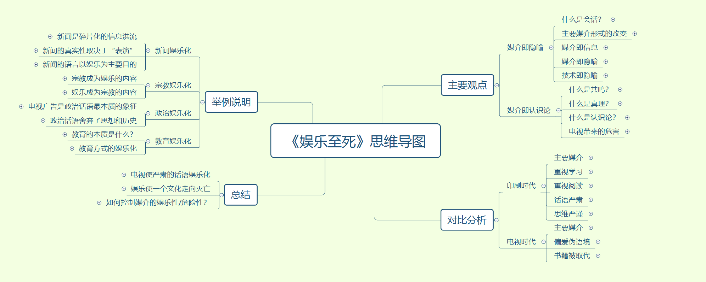

# 《娱乐至死》

## 作者简介

尼尔・波兹曼（1931 - 2003），世界著名的媒体文化研究者和批评家，生前一直在纽约大学任教。他在纽约大学首创了媒体生态学专业。直到 2003 年，他一直是文化传播系的系主任。2003 年 10 月波兹曼去世后，美国各大媒体发表多篇评论，高度评价波兹曼对后现代工业社会的深刻预见和尖锐批评。

波兹曼出版过 20 余部著作。他的主要著作包括《娱乐至死》、《童年的消逝》、《技术垄断》、《教学：一种颠覆性的活动》（合作者：查尔斯・韦恩加特纳）、《教学：一种保存性的活动》、《诚心诚意的反对》、《疯狂的谈话，愚蠢的谈话》、《如何看电视》、《建造通向 18 世纪的桥梁：过去怎样改变未来》。其中《娱乐至死》和《童年消逝》已译成多种文字在许多国家出版。

## 内容概述

今天，随着电视文化逐渐取代印刷文化，公众话语的内容和意义发生了改变。政治、宗教、教育、体育、商业以及其他公共领域的内容，都日渐以娱乐的方式出现，并成为一种文化精神。人类无声无息地成为了娱乐的附庸，我们变成了一个娱乐至死的物种。

本书的作者认为，一个文化中的主流媒介形式能够以一种隐蔽却强大的暗示力量重新定义现实世界，甚至塑造一个时代的文化精神。人们实际上是生存在媒介所制造的隐喻世界中而不自知，因此提出了“媒介即隐喻”的理论。

## 思维导图

## 收获感受

因为这本书，我重新拾起了阅读的习惯。

还记得以前读小学和初中的时候，每天最幸福的时光便是放学以后回到家中，晚上洗完澡后躺在床上的阅读时光。我也曾尝试过自己写小说，因为幼时的我总是喜欢沉迷于各种文学著作所描绘的虚幻世界之中，虽然一般这种冲动总是不会坚持超过一周。后来随着步入高中，学业压力增大，再到后来进入大学，各式各样的信息洪流充斥着我的大脑，竞赛、考研、就业以及各种娱乐，如动漫、小说、游戏、音乐等，我似乎逐渐丢掉了阅读的习惯与兴趣，也无心静下来思考，每天只是盲目地活着，做着周围的大家都在做的事，并不问缘由，也不在乎结果。

> 电视不禁止书籍，它取代书籍。

娱乐并没有限制我们进行阅读和思考，而是取代了它们。今天，人们的注意力越来越多地被短视频、游戏等娱乐所占据，我们更自由了，我们也更“忙碌”了。我们每天接触到的大部分信息都来自互联网，来自各种各样的视频，来自支零破碎的新闻和帖子。越来越少的人愿意静下心来读一本书，大家都不愿意放下自己手中的手机。

而我呢，也同样在长达近10年的时间中甚少阅读，当然，也很少对诸如当下生活的意义，未来的追求等宏大而抽象的事情进行思考，这不禁让我想起了以前高中英语课上学过的一句英文——“like a living ghost”，这说的便是我吧！

如今我已开始工作，初入职场，越来越多的现实问题也随之扑面而来，我似乎更加焦虑了，对未来的迷茫、对工作意义的怀疑以及一点对自我的否定。可能这也是我重拾阅读的契机吧，寄希望于在这纷乱的世界中，获得一剂精神的良药，缓解自己的痛苦。因此，我重新开始读书，并且坚持读好书，读各个领域的书。此外，我强迫自己在每看完一本书后都写点东西进行输出，逼迫自己去思考和总结，这篇文章便是我迈出的第一步！